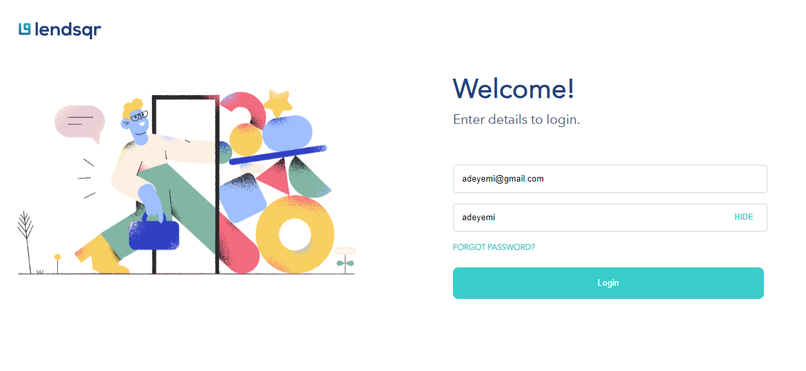
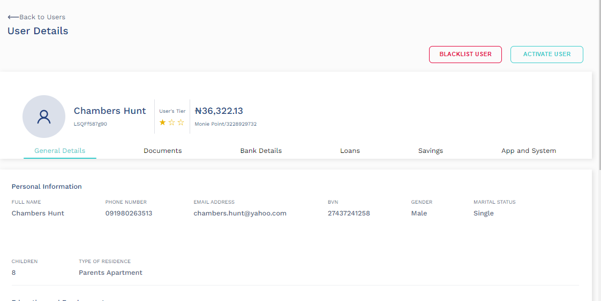
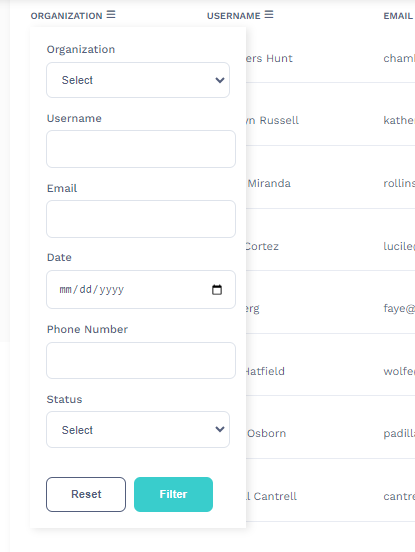
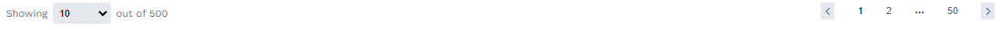
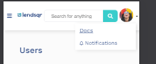

<h1 align="center">Welcome to lendsqr-fe-test 👋</h1>
<p>
  
  <a href="https://twitter.com/Timmi\_tech" target="_blank">
    
  </a>
</p>

> Test Assessment submission for lendsqr frontend engineering candidates

### 🏠 [Homepage](https://lendsqr-fe-test-rose.vercel.app)

## Install

```sh
npm run build
```

## Usage

```sh
npm run dev
```
## Navigating Around
<p>
   Login using email adeyemi@gmail.com and password adeyemi to continue to dashboard.
  
</p>
<p>
  on the dashboard click any user on each table row to view the user details.
  
</p>
<p>
  on the table headers click the icon associated to each table header to filter users using options
  
</p>
<p>
  Below the dashboard records are options to show number of records and paginations. Feel free to set accordingly
   
</p>
<p>
  On Mobile devices Dashboard options from the right have been moved to a dropdown box when the dropdown icon is clicked<br/>
   
</p>

## PS
<p> Json was genereted using <a href='https://json-generator.com/#'>json-generator.com</a> and API mocked using <a href='https://designer.mocky.io/'>mocky.io</a></p>

## Author

👤 **Oluwole Daniel Oluwatimileyin**

* Website: https://timmi-tech.kesug.com/
* Twitter: [@Timmi\_tech](https://twitter.com/Timmi\_tech)
* Github: [@Tiimmii](https://github.com/Tiimmii)
* LinkedIn: [@tiimmii](https://linkedin.com/in/tiimmii)